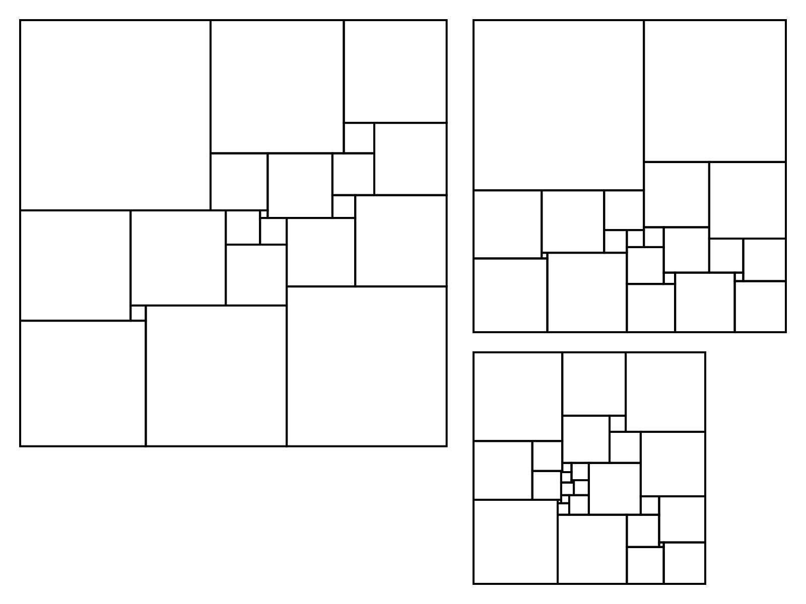

# Bouwkamp Code Generator

This Inkscape extension allows you to generate squared squares and squared rectangles from Bouwkamp codes and table codes.

You can paste Bouwkamp codes with or without various formatting characters (like brackets) and convert them to the corresponding squares. The following three simple perfect squared squares (SPSS) that were generated from Bouwkamp codes.

## Installation

1. Copy the files `render_bouwkamp_code.inx` and `render_bouwkamp_code.py` to your `~/.config/inkscape/extensions/` directory.
2. Restart Inkscape.

## Usage

1. Open the extension from the extension menu `Extensions` > `Render` > `Bouwkamp code...`.
2. Paste a valid Bouwkamp code or table code like these:
    - `22, 110, 110 [60, 50], [23, 27], [24, 22, 14], [7, 16], [8, 6], [12, 15], [13], [2, 28], [26], [4, 21, 3], [18], [17]`
    - `21 112 112 (50,35,27)(8,19)(15,17,11)(6,24)(29,25,9,2)(7,18)(16)(42)(4,37)(33)`
    - `22 139 139 80 59 21 38 29 28 17 27 7 10 18 20 4 3 32 8 1 31 30 24 2 22`
3. Click the Apply button.

## License

This project is open source licensed under the BSD 3-Clause License. Please see the [LICENSE file](LICENSE) for more information.